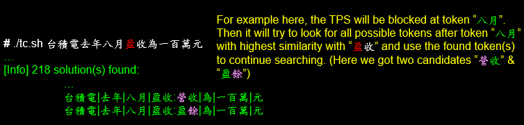

## Backend Service Introduction
Here we will introduce how to compile/run/maintain backend service. For the while project introduction, please refer to this slide.

* __Compile Backend Main Program__ <a name='backend_compile'></a>

## [Compile Backend Main Program](#backend_compile)
The Backend Main Program `STokenizer.jar` is used to carry out below two things while get called by web service [`index.py`](Backend/index.py):
* Apply TPS (Token Path Search) algorithm to tokenalize the given sentence
* Use collocation/correlation to look for suggestion of character(s) while encountering unknown token


The source code location of backend main program is [`Backend/src`](Backend/src). To compile it, please enter path [`Backend`](Backend) and use below command to compile the source code and build the backend main program `STokenizer.jar`:
```bash
// Check all available gradle task(s)
# gradle tasks --all
...

// Compile the source code > Wrap the jar file > Copy jar file into current working folder
# gradle copyJarToRoot
:compileJava UP-TO-DATE
:processResources NO-SOURCE
:classes UP-TO-DATE
:jar UP-TO-DATE
:copyJarToRoot

BUILD SUCCESSFUL

Total time: 0.656 secs
```
